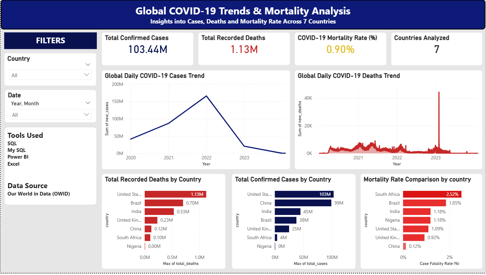

# Global COVID-19 Trends & Mortality Analysis

This project analyzes COVID-19 cases, deaths, and mortality trends across multiple countries using SQL and Power BI.

## Tools Used
- SQL
- MySQL
- Power BI
- Excel

## Key Insights
- Compared mortality rates across countries
- Analyzed global COVID-19 case trends
- Built KPI dashboards using DAX measures
- Created interactive visualizations and slicers

## Files Included
- Power BI Dashboard (.pbix)
- SQL Queries (.sql)
- Dashboard Screenshot (.png)

## Dashboard Preview

